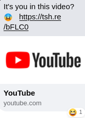
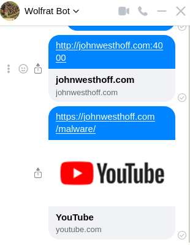
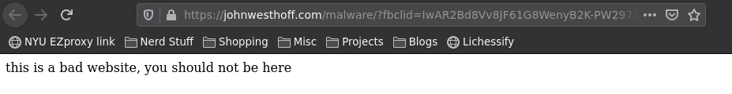

+++
date = "2021-05-05T14:03:30-04:00"
draft = false
title = "How That One Facebook Phishing Thing Worked"
heading = "Blog"
series = [ "Goofing off" ]
+++

A few days ago I got the same message from several friends on Facebook:

<!--more-->



If you clicked the link, it would ask you for your facebook login. This is actually really
clever, since I think a lot of people wouldn't think twice about that, since we know Facebook
does weird things with links, and having to sign in might not seem too strange.

But of course, the log in page was fake, and if you tried logging in they would hijack your
account and send the same message to everyone you have ever messaged. But how did it work?
Like, the preview clearly says _youtube.com_!

I figured it is either giving a fake social media blurb to show for the
link, or it is actually forwarding to youtube.com some of the time.
If it was the ladder, it could be checking something about the request Facebook
sends the webserver to generate the little preview - so I set up a quick experiment.

I ran `nc -l 4000` on `johnwesthoff.com` - this listens on port 4000 and spits out the data being sent there.
I then sent my chatbot a link to `http://johnwesthoff.com:4000`, which is a perfectly valid URL. Immediately
that `nc` command spat this out:

```
GET / HTTP/1.1
Accept: */*
Accept-Encoding: deflate, gzip
User-Agent: facebookexternalhit/1.1 (+http://www.facebook.com/externalhit_uatext.php)
Range: bytes=0-524287
Host: johnwesthoff.com:4000
Connection: close

```

What stands out there is the User-Agent - it very clearly identifies that the request is coming from Facebook and not
a user's web browser - for the record, here's what `nc` will say if I connect over Firefox:

```
User-Agent: Mozilla/5.0 (X11; Ubuntu; Linux x86_64; rv:85.0) Gecko/20100101 Firefox/85.0
```

So, what if the evil website is simply checking the User-Agent, and if it is facebookexternalhit then redirect
them to youtube.com, otherwise let them carry on to our malicious website? To test that, I through together this
php file, which is also available [here](https://johnwesthoff.com/malware):

```php
<?php
    if (strpos($_SERVER['HTTP_USER_AGENT'], 'facebook') !== FALSE) {
        header('Location: https://youtube.com');
        die();
    }
    echo "this is a bad website, you should not be here";
?>
```

Essentially, we just check if the User-Agent we are being sent has the word "facebook" in it, and if so, send them
on over to YouTube, otherwise show our evil content to the user. Let's see if it worked:




So yeah, that seems to be what they did. If you click on that link, then it takes you to a very scary,
very much not youtube website:



From there they used a URL shortener to help hide their intent further, which again isn't like, terribly suspicious.
I'm not really sure what the best way to defend against something like this is, other than if you are ever
logging into a service anywhere, you should check the URL bar and make sure it belongs to the company
you are trying to log in with.
