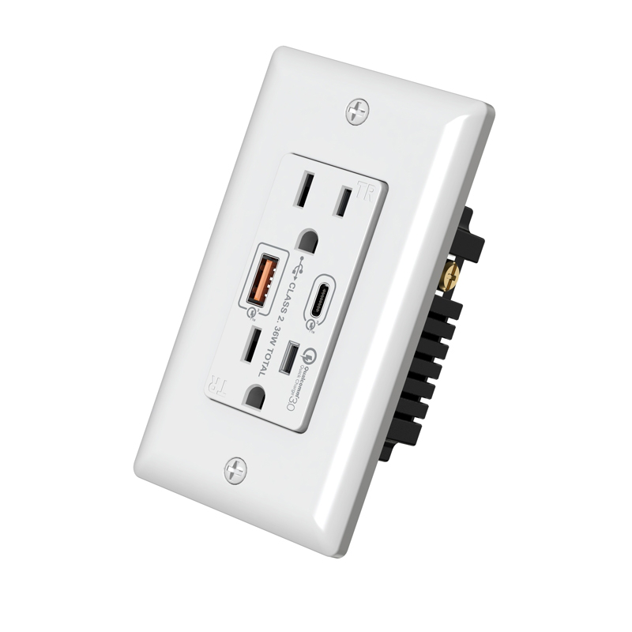

+++
date = "2021-09-20T16:04:14-08:00"
draft = false
title = "An Idea For Wall Outlets"
heading = "Blog"
categories = [ "For Fun" ]
series = [ "The Fire Nation" ]
+++

I've been seeing those outlets with USB ports more often
lately, but they feel awfully behind.

<!--more-->

After all, more and more things are already moving to USB C, and for good reason. 
I really enjoy being able to use one cord and charger
for my phone and laptop. It's just incredibly convenient.
But a USB A end doesn't let me do that, so what I really want
are these newer USB C Power Delivery wall sockets, like
the one depicted below:

This got me thinking, if USB C can carry data too, why
not put that to good use? 
So, I propose the following, mostly as a future reminder
that I should look into doing this myself in the future
when I am a home owner:

1. Wall outlets anywhere a laptop or phone might be plugged into (near desks, near the sofa, bedside, etc.), should have a USB PD port.  
2. Wall outlets anywhere a laptop might be plugged into should have their USB C PD port connected to a USB C hub with an ethernet adapter already connected to the home network.  
3. Wall outlets in rooms with central displays (family room TV, etc.) should have their USB C PD port connected to a displayport to HDMI adapter, with other end of the HDMI port routed through the walls seemlessly to the display.  

These three together mean when I'm working from my sofa, my laptop is being charged, it has high speed ethernet connectivity, AND I can mirror my screen to my TV for games/shows/whatever. It's the future!

(Disclaimer, I'm sure this idea is not up to modern building codes, but hopefully that can change.)
