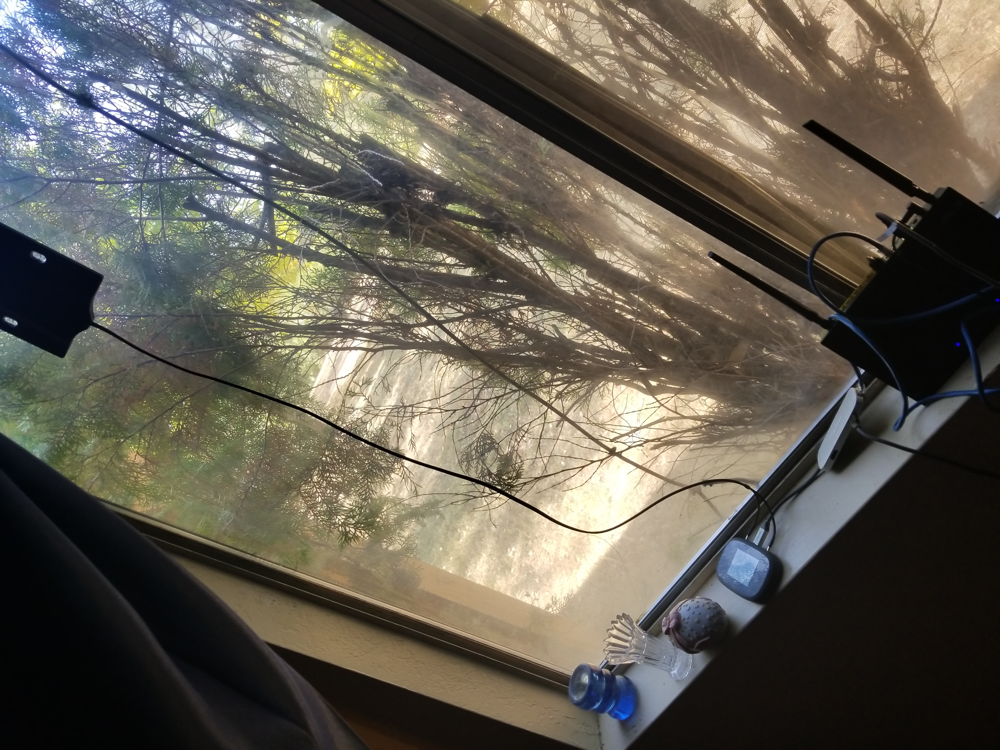

+++
date = "2021-10-03T16:03:30-04:00"
draft = false
title = "The Valley of the Great Digital Divide"
heading = "Blog"
tags = [ "Rural" ]
categories = [ "Rural" ]
series = [ "Fixing stuff" ]
+++

Oh, Hello Deborah, Simone, _the internet_. Speaking of the internet, I
recently moved to Northern California - specifically Shasta County, where
more than 40,000 people, myself included, lack broadband internet. Now, I
currently work as a Software Engineer, so having the internet is very important
for me to work - here's how that's going.

<!-- more -->

I guess I should begin by describing what internet we do have. Currently,
the house I'm living in is connected to TDS DSL, at a blistering megabit or so
download, and a blazing 300 kilobits per second upload. 
Now, with nothing else connected, we do hit those speeds. But even without a heavy
network load, my ping to a Los Angeles server is over 200ms on the DSL line. This makes it
entirely unusable for almost any use-case. Now, TDS _was_ rolling out a
legally-the-minimum-required-to-be-called-broadband plan, but when we called TDS basically
said that despite the house formerly having a 5Mbps connection with the option for 10Mbps,
our plan is the fastest they can offer us. Big oof.

So the obvious choice is for us to switch internet providers, right? Yeah. Haha. What internet providers?
We live close to Redding, Candycornia, where much of the area does have gigabit internet through Spectrum.
In fact, a development about half a mile away has said plan available to them. But not us - we actually don't have
any other wired service provider that will serve our house. So what about wireless?

Well, Verizon, AT&T, and T-Mobile all have fixed LTE home internet services. Surely those would be available here - after all,
all three big providers have (or at least, claim to have) service at our house. Well, for whatever reason, none of them provide
their fixed wireless internet to our house. Why? As far as I have seen, they only seem to offer this service to buildings in
areas that they serve with fiber. I just don't understand that at all. Perhaps it's a legal thing? Or maybe a competition thing?
But it seems like this area, with very few options, would be perfect for that service. In fact, I _know_ it would be a workable
solution - more on that later.

Another option some places have, though with many drawbacks, is to go with a wireless internet service provider, or WISP.
We have at least three choices that I know of (as in, they serve some area near us, not necessarily
our house): Warp2, ShastaBeam, and digitalpath. But there are downsides. First, the price: Warp2 and ShastaBeam require
$150 to install, I don't think digitalpath has an installation fee, but they might and just not tell you. 5Mbps is $50 with warp2,
3Mbps is $54 for ShastaBeam, and digitalpath has so many different pricing tiers depending on location I don't even know
what number to quote. ShastaBeam tops out at 30Mbps, Warp2 at 25Mbps, and digitalpath tops out between 25 and 75Mbps depending
on location. Digitalpath also has datacaps, but on pricier plans they're practically enough for the vast majority of people
(2.5TB of data, sure you could use that up if you tried, but that would be enough for me and I am probably a heavy user).
Weather can mess with service (well, I guess all internet connection types run that risk), and line of sight is really
important. For home internet without a wired connection, WISPs are definitely a great option, though it is a shame
ISPs really do not want to wire up every home.

What we decided to do, however, is use get a mobile hotspot plan from Verizon. Sure, there are legally and ethically
gray methods involving masking hotspot data as phone data that would be cheaper, but we need this connection for work.
If it goes out because we got caught or the cell carrier fixed the detection method, well, in a single day we'd lose whatever
we saved by being sketchy here. By all means if you think it is the best method for you, I'm not going to stop you. I don't
even know you. Anywho, we bought a MiFi 8800L or something like that, and it gets us something like 6Mbps down and 10Mbps up
with a 60ms ping to LA.
Now, I'd really really really like more. At NYU, I had gigabit internet. At my wife's house in Massachusetts, we had 100Mbps down, 
and after I identified a bug in my router's firmware, 400Mbps down. But, I really don't actually _need_ more than 6Mbps down.
This wireless connection actually works really well for us. We can easily take remote meetings, as my wife and I both work
with teams that keep their videos off. Sure, people will share screens, but 6Mbps is enough for that with just two people using
the connection solely for work purposes. And the 10Mbps upload? Well, that about matches what we had anyway, and git pushes
complete quickly without issue. There are some really big problems we need to overcome, however.

The first issue is, well, I would like it faster. So I bought [this antenna](https://www.amazon.com/Netgear-6000450-MIMO-Antenna-Connectors/dp/B00DN3J03O/ref=sr_1_20?dchild=1&keywords=mobile+hotspot+antenna&qid=1633323491&sr=8-20).
It, well, didn't help. Verizon has the best coverage in our area by a wide margin, so there are a lot of
users on the network, bogging it down. The best speed I've seen from Verizon so far anywhere with my phone
is about 7Mbps down, so this antenna will never improve speeds all that much. I'm keeping it for now, because
I want to experiment with T-Mobile, whom I am waiting on to send me a Test Drive mobile hotspot. It might also have
some reliability benefits, but I have neither measured nor noticed any. The signal is measurably stronger, however.

The next issue is that the little mobile hotspot isn't really up to snuff to broadcast to our entire house. Fortunately,
I've kept every WiFi router I've ever owned, and even brought two with me to the west coast. I don't know why. But it came in handy!
I took one of the half dozen USB-C dongles I bought, one with an ethernet port, and plugged it into the MiFi.
**This does work.** I have seen people online claim it will not, but I mean, I'm doing it, and it is working. So I have
the MiFi hotspot disabled, it is sending the interwebs through a USB-C ethernet dongle to my router's WAN port,
and my router provides the entire house with a strong signal. I can even keep the MiFi charged through the USB C dongle, which
has its power plugged into my router's USB port. If it turns out T-Mobile is a lot faster but only outside, I might get
a PoE kit and have a lot of fun with that. But for now, here's a picture of my setup.

The biggest issue with our solution, however, is we are capped at 100GB per month. After that, the 600Kbps is unusable for work.
We use just about 100GB/mo on work, but we need to be careful. I also cannot download video games or updates or anything like that.
When I need to do that sort of thing, I will either use the DSL and wait a long while, or, much faster, drive to a 
cafe/library/rentable office, and do the download there. Also, I am waiting on a SIM from Visible, who should provide an unlimited
data connection to one device for $40/mo, or two devices for $35/mo, which should nullify this issue. There are also
other unlimited data providers out there, for all of the major networks.

Now, we're actually fairly lucky in that we at least have options. LTE is fast enough to get work done, and Redding has
plenty of places for us to head to if we actually need fast internet. But not everywhere in the country is like that. And even
still, why should we _have to leave our homes during a pandemic_ to get access to _the internet_? This is clearly a problem,
and throwing money at it doesn't seem to be helping. As far as I know, just one houshold per census block needs to be serviced 
for an ISP to claim they service an area and get their checks. I'm not at all a policy making expert, but it does seem we need
a new strategy if we actually want to bridge the digital divide. And this year really showed why doing so is important - 
there are people in rural areas who needed to work remotely this past year. Children who needed to learn. And all of that
was made far more difficult than it had to be. 

Oh, I guess starlink is a thing. But the waiting list is pretty big. Except I can order it way sooner for my hometown of Horsham PA,
because nobody there is using it (because why would they need it?). And speaking of absolute moonshots, another idea is to kinda
make your own WISP by begging a neighbor with fiber to let you put radio dishes on their house. Not sure how practical it is, but
maybe I can explore that while I live here. And obviously there's the nuclear option, which is to live somewhere else. Though
I guess if all of rural america did that we'd starve.
