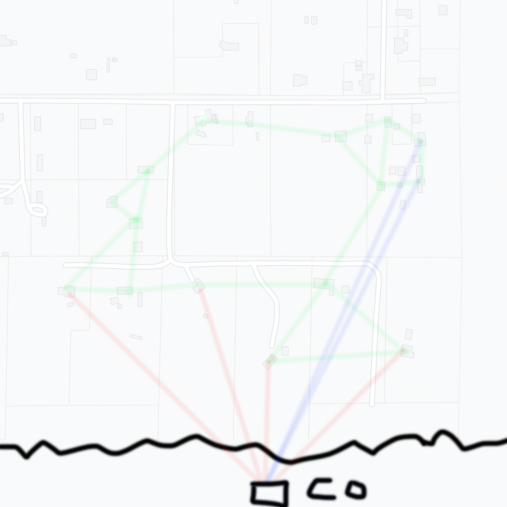

+++
date = "2021-11-21T16:03:30-04:00"
draft = false
visible = false
title = "Throwing ISPs Into The JUNCCBIN"
heading = "Blog"
tags = [ "Rural" ]
categories = [ "Rural" ]
series = [ "Fixing stuff" ]
+++

My internet woes will be solved, be it by moving to a different house, by Starlink, or by getting an ISP to actually
service an area. But that doesn't solve _the_ internet problem.

<!-- more -->

Motivation
==========

Right now an insane number of people in the world, even in America, _even in a high tech state like California_, do not
have broadband internet. More importantly, throwing money at ISPs does not yield meaningful results. Happy Valley California
has had hundreds of households with 1Mbps DSL connections for almost two decades, and the major telecom company in the area
is using their grant money... to build out 25Mbps DSL connections. Sure, a 25x improvement here would be to die for, but
by the time its complete, well, congress may have already redefined "high speed broadband" to 100Mbps or something. 

Now, not all of these people without broadband are in the same boat. We are fortunate enough to have a DSL connection,
and even OK LTE speeds - I was able to find a spot in the yard where I even got 23Mbps! We also have not-too-distant neighbors
with **GIGABIT FIBER**. I will refer to households like ours as "sub-rural". There are other homes with no LTE signal at all, or
no neigh neighbors whatsoever. These households I will refer to as "far-rural". 

It is my goal to describe a way by which sub-rural and far-rural households can achieve internet connectivity, through a series
of techniques that maybe don't work whatsoever, but I would love to find out. I call my overall system JUNCCBIN, for 
"Jeff's Utopian Neocapitalist Cooperative Channel Bonded InterNet".

Goals
=====

Ideally, any sub-rural or far-rural household would be able to do three major internet tasks:  
1. Teleconference - being able to communicate in real time over the internet, especially in the wake of the COVID-19 pandemic, is vitally important. Video conferencing software demands low latency and a moderate amount of bandwidth.  
2. Video streaming - for entertainment and informative purposes, being able to watch pre-recorded content is very useful in the modern world. Video streaming demands high bandwidth for a good experience, but can tolerate high latency.  
3. Web browsing - the world wide web is an invaluable resource, even to people who live out in the country. It doesn't have particularly high demands in either latency or bandwidth, but benefits from both being favorable.

Design
======

At a high level, the goal of JUNCCBIN is to form a local network among the households in a given community, and aggregate
their connectivity resources for the betterment of everyone within the community. In order to incentivize sharing, members
of the network may be reimbursed based off of how much their network connection was used by the community.

JUNCCBIN relies on a series of cooperative neighbors making use of Cooperative Relay Nodes (CRNs). Each CRN consists of one or more
Cooperative Links (CLs) that join each CRN to other CRNs. A CL might be a physical connection, such as ethernet between two households,
or it may be a radio link over longer distances. CRNs may have one or more Internet Links (ILs) that connect the CRN to the internet
at large.
Each CRN also contains a Network Controller that can run some logic on every packet going between its CLs + ILs - this is what allows
tracking of network usage for billing and reimbursement. **MAY NOT BE TRUE, MAYBE THE CO DOES THAT, OR MAYBE BOT**

Each household sets up a CRN by connecting it to one or more of their neighbor's CRNs, as well as their own internet connections
(if any).

Outside of the rural community, there is a Cloud Orchestrator (CO). It is located in Denver. Ever CRN proxies all of their IL packets
to the CO. The CO is then responsible for sending the packets to the correct destination along its very very high speed super duper
gigabit internet connection. The CO can help with billing by determining who the packets came from along with which CRN's IL
was used to deliver the packets. 

To aid far-rural connections, multiple CRNs owned by a single household could be installed along poles to a neighbor willing
to share (in this case, practically sell) their internet to the household. It is possible to build the CRNs both cheaply and
in a way that they could be solar powered, making it very inexpensive and easy to connect households potentially hundreds
of miles away by chaining CRNs.

In order to meet our goals, JUNCCBIN's CRNs will automatically route traffic based off of prioritization rules on a per-application
basis. Video streaming applications will be routed to high-bandwidth connections, or split off to several lower bandwidth connections.
Teleconferencing applications, on the other hand, will be routed through the lowest latency path. The CRNs may potentially re-route
applications as new streams are formed. For example, if someone is watching YouTube while another person is joining a Zoom call,
the network may change the YouTube route to allow the Zoom call to have a lower latency connection.

Pleeeease look at this graph:

In this picture, there are a number of households (the rectangles in the gray area) that
each have a CRN. Connections between CRNs are shown in green. Some CRNs have Internet Links.
These are shown in red for low speed DSL connections, and blue for high speed fiber 
connections. These CRNs use these connections to proxy all of their traffic to the CO.

Implementation
==============

I'm poor and have implemented none of this. Please fund me. It would be nice to do a few things:  
1. Have a simulator of the idea.  
2. Have a real world deployment of several households.  
3. Make the solar powered CRN for far-rural deployments.  
4. Implement the CO and the software for the CRNs.  
5. Conquer the world.  

