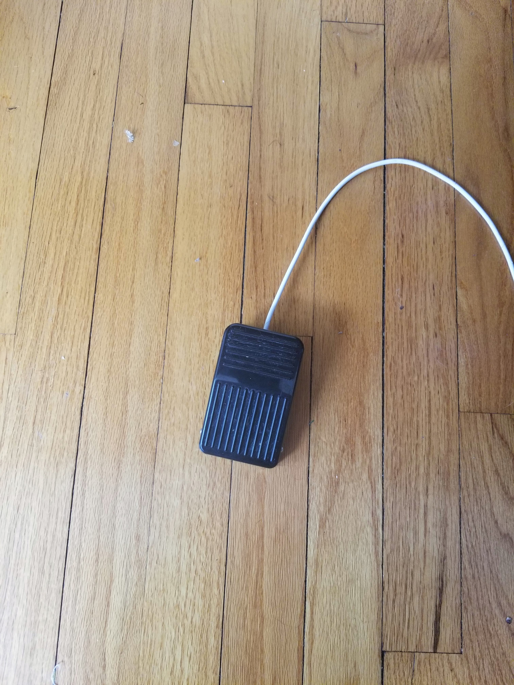

+++
date = "2021-06-15T16:03:30-04:00"
draft = false
title = "Sorry I was alching"
heading = "Blog"
tags = [ "RuneScape", "RP2040" ]
categories = [ "RuneScape" ]
series = [ "Goofing off" ]
+++

Since I was a medium-sized child, I've enjoyed playing the MMO [RuneScape](https://oldschool.runescape.com/).
It is by far the game I've spent the most time playing, and, well, despite that, I'm not very far in the game at all.

<!-- more -->

I started sometime in 2006 and, being that the internet _hadn't even been invented yet_, I was constantly lost.
Even though the game had only been around for ~5 years, it was still absolutely massive. After a year or so two
of my cousins started playing, and one of them introduced me to a clan-chat, where I would spend a thousand
hours or so talking to people while cutting trees. I didn't do it very efficiently, and after all that time
I had gotten only to level 90 woodcutting. Now, despite that being only 9 levels shy of the maximum level for
a skill (at the time), it is a mere **41%** of the total experience points required for level 99. I stopped playing
the game when it became RuneScape 3, forever leaving my character stuck at 41% of 99 Woodcutting.

When Old School RuneScape was released I made an account and played a little every few months, but I certainly didn't
actively play it. But once the pandemic started, I realized that since most of the game is so passive I could
probably play it more. Now, a lot of people who play the game play it during work/school/whatever. Personally, I can't
do that - even if I only have to glance over at the screen every 5 minutes that's distracting enough to ruin me - so I
don't. But what if I could?

The game has several activities that literally only involve clicking in the same spot over and over, for as much time as you
want. One of these tasks is casting the spell High Level Alchemy, which turns one item into an amount of gold equal to what
a specialty store in the game would pay for it. This can make you a small amount of money if other players are willing to sell
you items for less than their High Alchemy value. Additionally, it grants you a fair amount of experience in the Magic skill,
which can be moderately expensive to train otherwise. I realized that, since I'd just be clicking in the same spot over and over,
I could use a foot pedal to click a mouse on a spare laptop while I work. This should be easy,
since I naturally shake my legs back and forth all the time. So I built this:



Now, inside this little box is a [small CircuitPython board](/blorg/circuitpythonshilling/) which
just pretends to be a mouse and clicks every time you press the foot pedal inwards. It has wires soldered to the internal switch
of the footpedal, and then a USB cable coming out to plug into a computer.


This has a couple of deal-breaking drawbacks. For one, it's very loud and annoying, both to me and my wife. It distracts me from work,
even, so I don't use it during the day. The foot pedal I used is not really meant for this, and has come apart during use. It also likes to slide
all over the place. So, I did what any reasonable person would do, and "built" this:


This is my new [RP2040 QT board](/blorg/circuitpythonshilling2/), with a very inexpensive [accelerometer](https://www.adafruit.com/product/4344)
wired to it using the [Sparkfun qwiic](https://www.sparkfun.com/qwiic) / [Adafruit STEMMA QT](https://learn.adafruit.com/introducing-adafruit-stemma-qt)
I2C system, which is a very cool idea because it means it takes a few seconds to play around with all kinds of sensors or actuators. I spent
a minute or so writing the following code for the board, which toggles the mouse state every time the accelerometer begins experiencing
an acceleration of about half a G:

```python
import board
import busio
import adafruit_msa301
import usb_hid
from adafruit_hid.mouse import Mouse

grav = 9.8 ** 2 # to subtract out the normal force
threshold = 50

mouse = Mouse(usb_hid.devices)
i2c = busio.I2C(board.SCL1, board.SDA1)
msa = adafruit_msa301.MSA301(i2c)
state = False
bounce = False

def doClick():
    global state
    if state:
        mouse.release(Mouse.LEFT_BUTTON)
    else:
        mouse.press(Mouse.LEFT_BUTTON)
    state = not state

while True:
    a = msa.acceleration[0] ** 2 + msa.acceleration[1] ** 2 + msa.acceleration[2] ** 2
    newBounce = abs(a - grav) > threshold
    if newBounce and not bounce:
        doClick()
    bounce = newBounce
``` 

Using this, I can just have the device vaguely on my leg/in my pocket, and as my legs naturally shake/rock back and forth, I am clicking,
so my RuneScape man repeatedly casts the High Level Alchemy spell on a pile of items. This is entirely zero-focus, opening my RuneScape "playing"
to new levels of efficiency.
