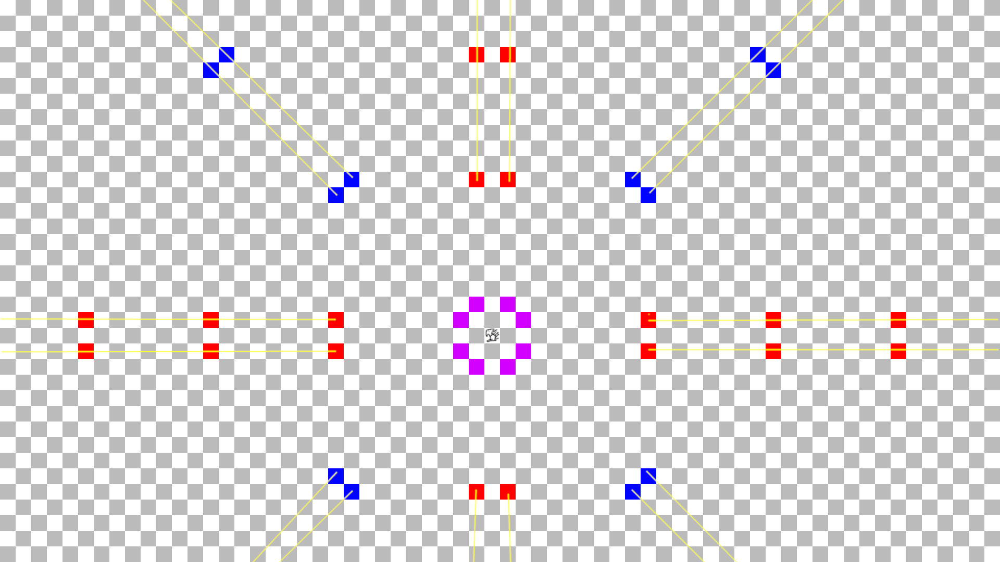

+++
date = "2021-07-22T21:54:00-04:00"
draft = false
title = "AlephZeroChess 1 - Knightly Ideas"
tags = [ "Projects" ]
categories = [ "For Fun" ]
series = [ "AlephZeroChess" ]
+++

Every since my personal hero made a [video about chess](https://www.youtube.com/watch?v=DpXy041BIlA), I've had a somewhat renewed
interest in the game. It's been gradually increasing too - last year on my brother's birthday I finally made a chess.com
account, and since then I've played a fairly modest 46 games, with most of them being Daily games. Recently, however, I've
had the desire to program something interesting related to the game.

# The Game Idea
I want to make an online multiplayer infinite chess game.
[Infinite Chess](https://en.wikipedia.org/wiki/Infinite_chess) is nothing
new, and many variants of it have been proposed and played around with over time.
In general, the typical variant of the game is that you have some finite number of
chess pieces arranged in a certain position relative to each other just like
normal people chess, but the game board extends infinitely in all directions.

The version I can find the most references to is the one proposed by Jianying Ji,
which is played with the standard pieces and rules on an infinitely large board,
but with the following 3 changes:
1. Knights are replaced by [nightriders](https://en.wikipedia.org/wiki/Nightrider_(chess)), which move like a knight but can extend their move as many times as they wish.  
2. Pawns can only promote after passing all enemy pieces.  
3. Every piece must be within a set distance to a piece belonging to their opponent.  

Now, I agree with point 1 being somewhat required - even in the 4 player chess variant on chess.com I feel as though
knights are underpowered compared to bishops as they are very slow to move across the board. However, I disagree
with the implementation here - more on that later. Points 2 and 3 I can take or leave, but seeing as this is
an online game without pesky limitations of physical boards, I think rule 3 can be dropped for now. Pawns might
be too weak in this variant regardless, so I think rule 2 should be dropped - especially because without rule 3, a player
could just send a bishop a trillion squares away and no pawn would ever promote.

# Pawns
Pawns probably need some kind of buff. I would prefer, if at all possible, for
the game within an 8x8 square to be unchanged, however. So I'd like to avoid
directly buffing pawns. One thing I am considering is having the rank of pawns extending infinitely as well.
This has the added benefit of keeping rooks in line. This might be tricky to implement,
but I think it is worth exploring.

# Knights
The knight has to be able to move more, but a nightrider can make moves
within an 8x8 board that a regular knight cannot, which I don't want to do.
So I have a few ideas on how to resolve this.

First, how does a knight move? Well, like any child who has played chess can tell
you, knights move like the letter L. That doesn't seem immediately helpful to me.
The FIDE definition is that knights move to the nearest square that is not on the
same rank, file, or diagonal as the knight. That is to say, the nearest square
that a rook (rank + file) or bishop (diagonal) can move to. This is also
equivalent to saying a knight moves to the nearest squares a queen cannot, by the way.
Additionally, the shape a knight moves is the same as "have a rook move two squares,
and then move one square orthogonally". I guess that _is_ moving as an L. Yet another
equivalent definition is that a knight moves two squares like a bishop, then one square
like a rook back towards where it came from.

Perhaps then we can generalize this in a way that maintains the way knights move within
an 8x8 square. There are several approaches that I think make sense:
1. Knights can move like a rook does, 2 + 8k squares, for some integer k >= 0, and then one square orthogonally.  
2. Knights can move like a bishop does, 2 + 8k squares, for some integer k >= 0, and then move one rank or file back towards where it started.  
3. Knights can move following either pattern described by 1 or 2.  
4. Knights can move to the nearest blindspot of a queen, or to the nearest blindspot that is at least 10 squares away.  
5. Some other third thing.  

These movement patterns all behave the same within an 8x8 board, meaning they 
properly generalize how a knight moves. Additionally, they all maintain
another property that knights have, which is that they can move from square A
to square B on one turn, and then from sqaure B to square A on a future turn.
Now, unfortunately it seems like some compromise must be made, as the increased
mobility property I want is at odds with the property that knights cannot win
a tempo. But that is a sacrifice I am willing to make.

To help illustrate the movement patters, I drew a picture:

Purple is where a knight can always go, red is where options 1 and 3 can go,
blue is where options 2 and 3 can go, and the yellow line is where option 4 can go.
I am not sure what the best idea here is, but my brother suggested I go with 3,
and I can't argue with his reasoning of "I don't know", so I think
I'll start with that and balance from there.

# The Name  
I am very proud of the name **Aleph Zero Chess** as a website
for infinite chess. First of all, it sounds like a certain 
[computer program that plays chess](https://en.wikipedia.org/wiki/AlphaZero) 
just OK I guess. Can I say that? Like, is that some kind of trademark thing?

In that case, that is purely coincidental! The name honestly and truly was
inspired by the fact that the set of spaces on an infinitely large chess board
has the cardinality ℵ0, aka aleph-null or aleph-zero. Also, the domain
name alephzerochess.com wasn't taken!

