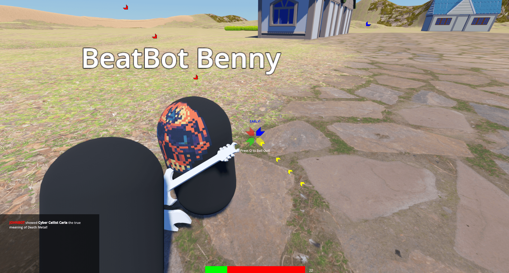

+++
date = "2024-02-18T21:54:00-07:00"
draft = false
title = "A year? of Game Jams"
tags = [ "Projects" ]
categories = [ "For Fun" ]
series = [ "Game Jams" ]
+++

My friend Emil and I entered a game jam in January, another in February, and plan on one in March. This has been a rollercoaster of the highest order.

<!--more-->

Spydentity Crisis
=================

Summary
-------

Our first jam submission was a 2D platformer named Spydentity Crisis. It was inspired by games like
10 Second Ninja where you have to finish small levels as fast as possible. The... hook... of the game
is that you use a grapple hook to fling yourself around. I find it really enjoyable, actually. Oh,
and the plot involves you slapping phones out of people's hands. So that's a plus.

Trials and Tribulations
-----------------------

Going into the jam, we wanted to use a game engine rather than start from scratch. We decided, however,
if we were going to learn a new engine, we should at least use a language we know. We saw that Godot supported C#,
so we settled on that. This was a remarkably bad decision in many ways.

Godot is a good engine in many ways, and is a very impressive piece of software. But for game jams specifically,
it has some cracks. The engine is very quirky. The git plugin can crash it. Sometimes scene files get corrupted.
Sometimes your build silently dies and takes GitHub 6 hours to stop waiting, but you build on every commit and use
all your free actions for the month. Font scaling can do some weird things in a pixel art game. UI components are
frustrating. And when you introduce .NET into the mix, your chance of submit game jam drastic go down! It turns out,
on Godot 4, you can't export to web with C#. Properties in-editor frequently bug out, and either forget themselves or
just make things not work. Dealing with all of these quirks, as a new-comer, is very overwhelming. I liked the part
where the day of the deadline our player scene got corrupted by magic. That was fun.

The Rewrite
-----------

Because of the aforementioned problems, we did the obvious thing and re-wrote Spydentity Crisis in gdscript. This was
very relaxing but also super tedious, since the game was something like 3000 lines of C#. I also made it a point to keep 
the game working during the re-write, which meant dealing with the C# <---> GDscript interoptability.

[Play on Itch.io](https://johnbot.itch.io/spydentity-crisis)

Battle Royale of the Bands
==========================

Summary
-------

Recently, Epic Games added Guitar Hero to Fortnite. So we decided to add Fortnite to Guitar Hero by making a rhythm game where you
parachute into a map, find a guitar, and then fight other players by playing a rhythm game at them to eliminate them. It is a 3D, 3rd person,
online Battle Royale and Team Deathmatch game. 

Trials and Tribulations
-----------------------

We, uh, did a bit of an icarus with this one. The game was written in GDscript, and using [some shenanigans](https://johnwesthoff.com/projects/godot-web-terrain3d/) we got it
working for web. Unfortunately, we (ok, I,) uploaded a non-working windows binary to the submission by mistake. The web version occasionally forgets to play notes, a problem
we literally stayed up all night trying to resolve, and then the game gaslit us into thinking was fixed until after the deadline. An hour before the deadline, the itch.io page refused to connect to 
server we spun up, so I had to rapidly issue a letsencrypt certificate (which, sidenote, it's amazing how easy this is now!), and have godot use it. This broke the windows version because of effing
course it did, so we spent most of the last bit of time fixing it. Just to then upload a broken binary anyway. Yeah.

Continued Progress
------------------

We weren't really hoping to win this one. We mostly wanted to submit a fun idea and see if it had any potential. I think it's a fun idea and we plan on continue to work on it.
We had a lot of people involved this time. My niece provided some branding artwork for the game (she had previously provided us with the splash screen Wolfrat logo for Spydentity Crisis),
and Emil Jr offered (got voluntold?) to orchestrate us some original music to put into the game. He also provided us with the flub sound effect. In both games we used a lot of free and
paid for assets, but we plan on replacing those with our own. I mean, does it really make sense to have this low-rez Cloud Gate looking character on top of grass that's made
with 4K textures?

Conclusion
==========

10/10 am literally going to stay up until 8am making games few (if any) people will ever play again in a month and there's nothing any of you can do to stop me.
