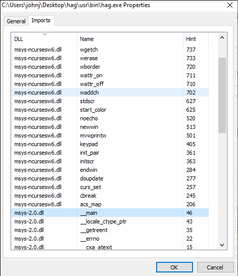
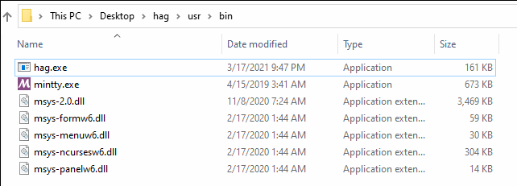
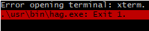

+++
date = "2021-03-18T08:24:00-04:00"
draft = false
title = "Running ncurses Applications on Windows"
tags = [ "Projects" ]
categories = [ "For Fun" ]
series = [ "Hag" ]
+++

A few weeks ago I finally beat the game a few friends and I wrote a while ago, [hag](https://github.com/a3qz/hag).
This sparked a desire to get the game running on Windows, the operating system of choice for e🅱️ic gamers.

<!--more-->

# First Attempts

At first I looked into ways to get it to compile on Windows. The game is written
to use [ncurses](https://en.wikipedia.org/wiki/Ncurses), a library for text-based user interfaces (TUIs).
I was hoping someone had written a version for Windows, but best I could tell, this was not the case.

The most promising path looked to be [PDCurses](https://pdcurses.org/), another library for TUIs. After poking
at it for about an hour, I realized it would be a fairly invasive change to hag. This was very discouraging.

# The Solution

For some reason I have [msys2](https://www.msys2.org/) installed on my Windows partition. Excitingly,
it has a package for ncurses, and can both build and run hag. So, worst case scenario, if I wanted
hag to run on Windows, I could ship people an msys2 install with the required libraries and hag already compiled.
The only problem is, a minimal msys2 install is something like 40MB, whereas hag is ~100KB. 40MB is enough to make
me not feel like downloading something, and I'm probably not alone.

But as it turns out, applications written for msys2 run on native windows so long as they have all of the required
DLL files. Using a program called [Process Hacker](https://github.com/processhacker/processhacker), it's easy to see
what DLLs a windows binary needs - I simply give it the compiled hag.exe binary, and it gives me the output pictured below.

Now, each of those DLL files may themselves import from other DLL files, but a simple DFS works great for grabbing every DLL I need.
I also wanted to have some control over the terminal itself - namely, to set size and fullscreen options before hag launches. So I
also took the mintty terminal that msys uses, which takes in size options on the command line, as well as the name of the application to run.
I packaged up the binaries I needed (hag.exe and mintty.exe) as well as all of the DLL files I needed, as sceen below.

I set up a bat script to run `.\usr\bin\mintty.exe -w full -s 360x100 .\usr\bin\hag.exe -w` from the root of my packaged files,
and at first run, this was the result.

This kind of error is one I'm somewhat familiar with. I copied the terminfo directory from `/usr/share` from my msys2 install into my
packaged `hag` folder, and then deleted all of the non-xterm entries. This did the trick, and when I ran the bat file, I was met with
hag running fullscreen natively on windows, in a folder of only 4.6MB that zips into a totally-acceptable 1.7MB.
